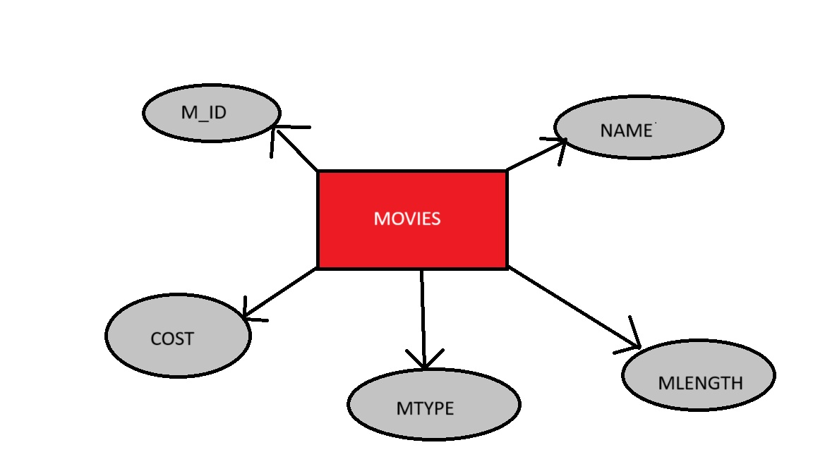
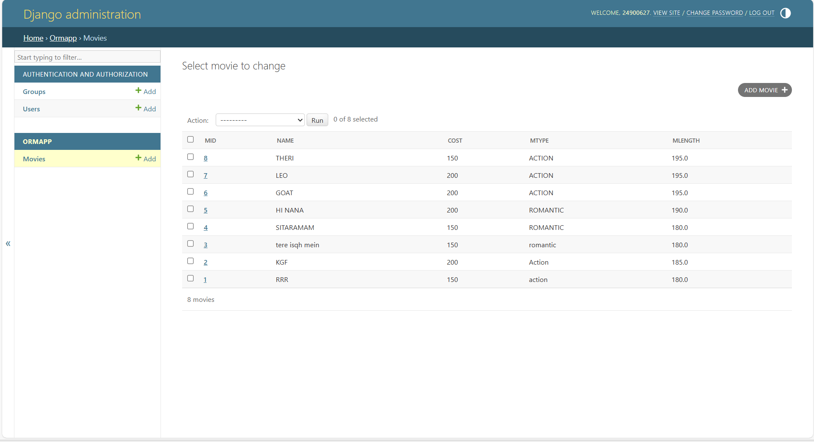

# Ex01 Django ORM Web Application
## Date: 11-02-2026

## AIM
To develop a Django application to manage an online food delivery platform like Zomato/Swiggy using Object Relational Mapping (ORM).

## ENTITY RELATIONSHIP DIAGRAM



## DESIGN STEPS

### STEP 1:
Clone the problem from GitHub

### STEP 2:
Create a new app in Django project

### STEP 3:
Enter the code for admin.py and models.py

### STEP 4:
Execute Django admin and create details for 10 books

## PROGRAM

```
admin.py

from django.contrib import admin
from .models import movie, movieAdmin
admin.site.register(movie, movieAdmin)

models.py

from django.db import models
from django.contrib import admin

class movie(models.Model):
    mid = models.CharField(max_length=20, help_text="Employee ID")
    name = models.CharField(max_length=100)
    cost = models.IntegerField(max_length=100)
    mtype = models.CharField(max_length=100)
    mlength = models.FloatField()

class movieAdmin(admin.ModelAdmin):
    list_display = ('mid', 'name', 'cost', 'mtype', 'mlength')

```

## OUTPUT



## RESULT
Thus the program for creating a database using ORM hass been executed successfully
